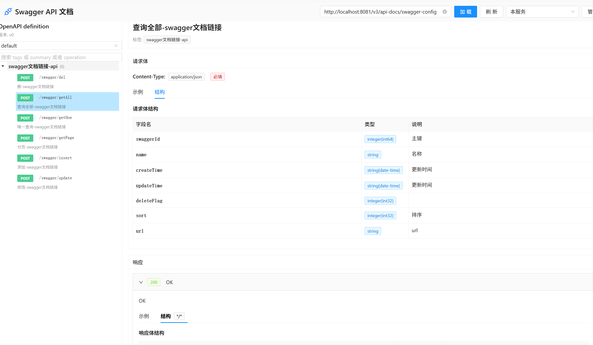

# Swagger Doc View 页面功能简述

此页面 Swagger / OpenAPI 文档查看与轻量测试工具，仅做下面这些事情：

1. 加载接口文档
   - 输入并加载 `http://host:port/xxx/v3/api-docs/swagger-config` 地址。

2. 管理文档配置
   - 新增 / 编辑 / 删除保存的 Swagger 文档地址（持久化在后端 H2 数据库）。

3. 分组切换（如果是 swagger-config）
   - 自动识别其中的多个分组（urls 数组），可下拉切换查看不同分组的接口。

4. 接口列表导航
   - 按接口的 tags 自动分组；未定义 tag 的归为“未分类”。
   - 支持搜索（tag / summary / operationId 关键词，高亮匹配）。
   - 点击某接口后在右侧显示详情。

5. 接口详情查看
   - 显示：请求方法（颜色区分）、路径、Base URL、概要、描述、标签。
   - 参数：列出各参数的来源位置、是否必填、类型、枚举、示例。
   - 请求体：按 Content-Type 分 Tab，展示自动生成的示例与结构化字段树（已展开 $ref）。
   - 响应：按状态码折叠，查看不同 Content-Type 的示例与结构。

6. 一键生成 / 复制示例
   - 自动生成并复制：Markdown 文档、cURL 命令、Fetch 调用代码。
   - 可复制：接口路径、Base URL、请求/响应示例 JSON。

7. 在线测试接口
   - 打开“测试接口”弹窗，填写参数、请求头（JSON）、请求体（JSON）。
   - 发送后展示响应状态码、响应头与响应体内容。

8. 本地记忆（提升使用便捷性）
   - 记住最近加载的文档地址、选中的接口、所选配置。

以上即页面的全部核心功能；无多用户体系、无高级测试历史，仅面向快捷查看与简单调试。

## 1. 直接使用 Docker 运行
- 运行容器（Linux/Mac）：

```bash
# 挂载 ./data 到容器 /app/data 用于持久化 H2 数据库文件
# 可按需覆盖端口、账号等环境变量（数据库文件路径已固定，挂载卷持久化）

docker run -d \
  --name swagger-doc-view \
  -p 8080:80 \
  -v $(pwd)/data:/app/data \
  -e TZ=Asia/Shanghai \
  -e SECURITY_BASIC_AUTH_USERNAME=admin \
  -e SECURITY_BASIC_AUTH_PASSWORD=admin123 \
  mmmm11111/swagger-doc-view:v1.1.1
```

- 访问
    - 应用：`http://localhost:8080/`（首次会弹出 Basic Auth 认证框）

## 2. 使用 Docker Compose 启动

- 新建 `docker-compose.yml`（示例）：

```yaml
version: "3.8"
services:
  swagger-doc-view:
    image: mmmm11111/swagger-doc-view:v1.1.1
    container_name: swagger-doc-view
    ports:
      - "8080:80"
    environment:
      TZ: Asia/Shanghai
      SECURITY_BASIC_AUTH_USERNAME: admin
      SECURITY_BASIC_AUTH_PASSWORD: admin123
    volumes:
      - ./data:/app/data
    restart: unless-stopped
```

- 启动与查看日志：

```bash
docker compose up -d

docker compose logs -f
```

